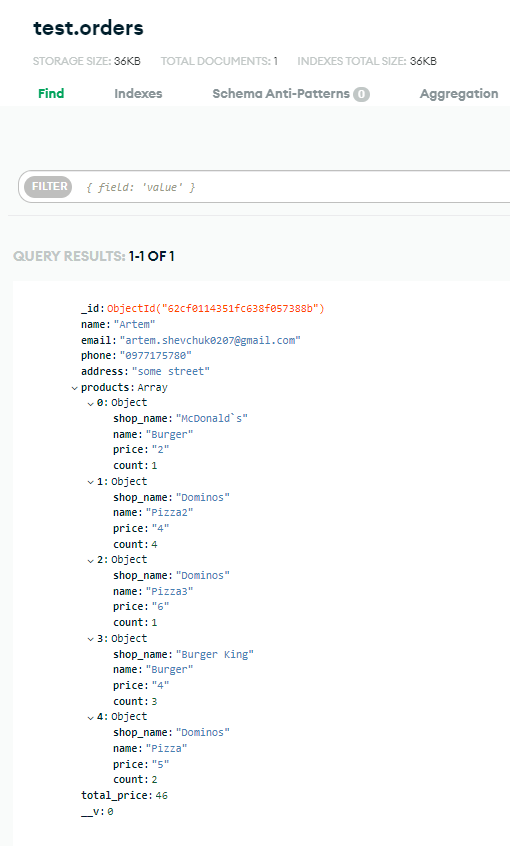
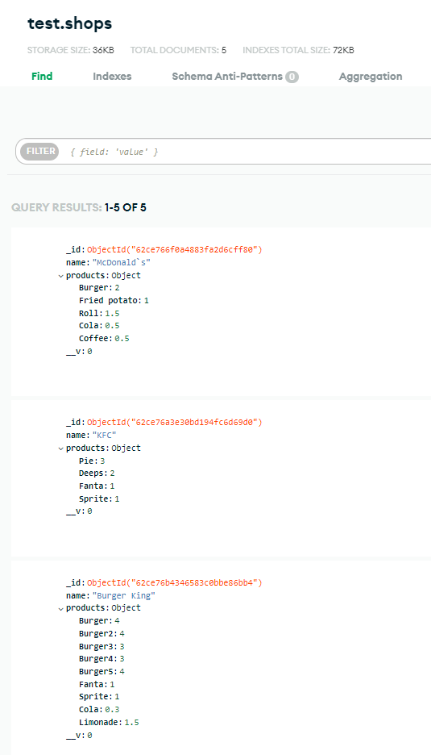
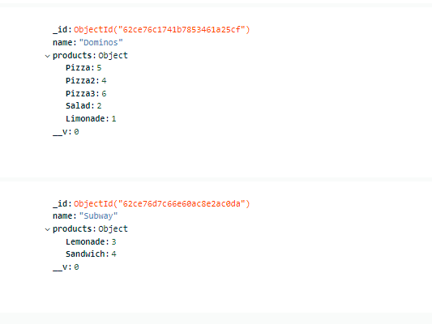

# Delivery App
Test web application for eliftech

# Install and run application
> Requires pre-installed NodeJS and NPM
* Installation
  1. Clone repository
  2. In console: npm install
* Run app
  1. In console: npm run dev
  2. In browser open https://localhost:5000

#Screenshots of the database and video of the app
- ###[Google Drive link to video](https://drive.google.com/)
- ###Orders database

- ###Shops database

######
